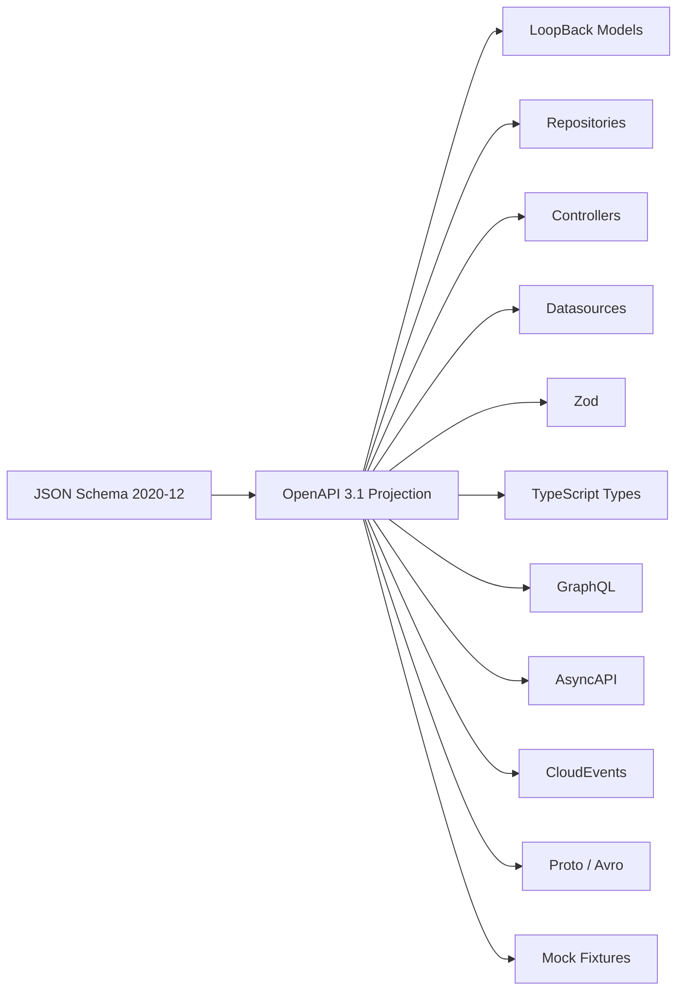

# @ebarahona/loopback-contracts

Contract (JSON Schema-first) code generation and projection architecture for LoopBack 4.

`@ebarahona/loopback-contracts` turns JSON Schema contracts into OpenAPI 3.1 specifications, then projects those specifications into LoopBack 4 runtime artifacts such as models, repositories, controllers, datasources, and optional ecosystem sidecars.

Optional sidecar emitters can also generate:

- Zod validators
- TypeScript types
- GraphQL
- AsyncAPI
- Protocol Buffers
- Avro
- CloudEvents
- OpenAPI component fragments
- mock fixtures

It is built for teams that want the speed of contract-driven scaffolding without giving up LoopBack 4's dynamic dependency injection, extension points, and composable runtime architecture.

---

# Why this exists

Most backend teams end up describing the same shape multiple times:

- JSON Schema
- OpenAPI schemas
- LoopBack models
- repositories
- controllers
- validators
- generated types
- SDKs
- event payloads
- mock fixtures

Over time, those definitions drift.

`@ebarahona/loopback-contracts` makes JSON Schema the source of truth.

Define the contract once.
Generate the rest.

---

# Mental model



The contract is the source of truth.

Everything else is a projection.

---

# What this project is

`@ebarahona/loopback-contracts` is:

- a JSON Schema-first code generation system
- a projection pipeline
- a LoopBack-oriented generator architecture
- an extensible emitter framework
- a contract-first backend workflow

---

# What this project is NOT

`@ebarahona/loopback-contracts` is NOT:

- a runtime transport framework
- a Kafka framework
- a Redis Streams framework
- a queue system
- a workflow engine
- a NestJS replacement

Some generated sidecars such as AsyncAPI or CloudEvents can describe message contracts, but this package does not provide the runtime infrastructure that sends, receives, retries, persists, or orchestrates messages.

---

# Who this is for

- Existing LoopBack 4 teams who want less boilerplate while preserving LB4's dependency injection, repositories, extension points, and OpenAPI-first architecture
- LoopBack 3 developers who miss rapid model-first API development and want a modern TypeScript migration path without giving up productivity
- NestJS developers interested in stronger contract-first workflows, runtime composition, and LoopBack 4's dynamic dependency injection and extension system
- Platform and infrastructure teams using a single contract to generate and synchronize APIs, backend services, mobile clients, validators, schemas, edge runtimes (Lambda, Cloud Run, Workers), and reusable architecture across an entire platform

LoopBack 4 was designed differently from most Node.js frameworks.

Instead of focusing primarily on decorators and application structure, LoopBack 4 uses a highly composable backend architecture built around:

- runtime dependency injection
- extension points
- dynamic discovery
- repository patterns
- datasource abstraction
- OpenAPI-first APIs
- transport-agnostic composition
- pluggable framework primitives

These capabilities make LoopBack 4 especially powerful for:

- platform engineering
- reusable backend systems
- multi-service architectures
- framework extensions
- large-scale enterprise applications

But many teams still spend significant time manually wiring repetitive framework artifacts.

`@ebarahona/loopback-contracts` preserves the architectural strengths and runtime flexibility of LoopBack 4 while dramatically reducing boilerplate through contract-first generation.

Instead of manually maintaining:

- models
- repositories
- controllers
- validators
- generated types
- OpenAPI synchronization

Define the contract once and project the framework artifacts automatically.

---

## Former LoopBack 3 users

LoopBack 3 was fast.

Many developers still miss:

- rapid CRUD scaffolding
- model-first workflows
  - model.json
  - model.config.json
- convention-driven APIs
- low-friction development

`@ebarahona/loopback-contracts` aims to recover some of that productivity while preserving the architectural strengths of LoopBack 4:

- TypeScript-first
- Dependency Injection
- OpenAPI-first APIs
- extension points
- composable runtime architecture

---

## NestJS users

NestJS provides strong developer ergonomics and a familiar application structure.

But as systems grow, many NestJS applications become heavily centered around statically wired modules, decorators, DTOs, validators, and generated types that must be manually synchronized across services and platforms.

LoopBack 4 was designed differently.

Its runtime architecture is built around:

- dynamic dependency injection
- extension points
- runtime discovery
- pluggable framework primitives
- transport-agnostic composition

This makes LoopBack 4 especially powerful for:

- platform engineering
- reusable backend systems
- internal frameworks
- multi-service architectures
- contract-driven platforms

`@ebarahona/loopback-contracts` combines that runtime flexibility with a contract-first workflow.

Define the contract once and project:

- OpenAPI specifications
- models
- repositories
- controllers
- validators
- generated types
- mobile/client contracts
- edge runtime artifacts

## The contract becomes the source of truth for the entire platform.

# Features

Core LoopBack outputs:

- LoopBack 4 models
- repositories
- controllers
- datasources
- OpenAPI 3.1 output
- generated barrels
- project meta-schemas

Optional sidecar outputs:

| Flag                        | Output                        |
| --------------------------- | ----------------------------- |
| `--emit-zod`                | Zod validators                |
| `--emit-types`              | TypeScript interfaces         |
| `--emit-graphql`            | GraphQL code-first decorators |
| `--emit-graphql-sdl`        | GraphQL SDL                   |
| `--emit-cloudevents`        | typed CloudEvents wrappers    |
| `--emit-asyncapi`           | AsyncAPI fragments            |
| `--emit-proto`              | Protocol Buffers schema       |
| `--emit-avro`               | Avro schema                   |
| `--emit-openapi-components` | OpenAPI components fragment   |
| `--emit-mock-data`          | mock JSON fixtures            |

---

# Installation

```bash
npm install @ebarahona/loopback-contracts
```

Install LoopBack peer dependencies:

```bash
npm install @loopback/core @loopback/repository @loopback/rest
```

Node.js requirement:

```txt
Node.js >= 20.19.0
```

---

# Optional sidecar dependencies

Sidecars are loaded lazily.
Install only what we emit.

| Sidecar          | Install                                 |
| ---------------- | --------------------------------------- |
| Zod validators   | `npm install zod json-schema-to-zod`    |
| TypeScript types | `npm install json-schema-to-typescript` |
| GraphQL          | `npm install quicktype-core`            |
| Protocol Buffers | `npm install quicktype-core`            |
| Avro             | `npm install quicktype-core`            |
| CloudEvents      | `npm install cloudevents`               |
| Mock data        | `npm install json-schema-faker`         |

If an emit flag is enabled without the required package installed, generation fails fast with the missing package name and install command.

---

# Quick start

Initialize the project:

```bash
lb-contracts init
```

Add a datasource:

```bash
lb-contracts ds primary --adapter memory
```

Create a contract:

```bash
lb-contracts contract order
```

Generate artifacts:

```bash
lb-contracts gen
```

Generate with sidecars:

```bash
lb-contracts gen --emit-zod --emit-types --emit-openapi-components
```

Run in watch mode:

```bash
lb-contracts gen --watch
```

or:

```bash
lb-contracts dev
```

Validate without writing generated output:

```bash
lb-contracts validate
```

---

# Example workflow

Create a contract:

```bash
lb-contracts contract order
```

Generated files:

```txt
schemas/order.schema.json
configs/order.config.json
```

Example schema:

```json
{
  "$schema": "https://json-schema.org/draft/2020-12/schema",
  "$id": "order",
  "title": "Order",
  "type": "object",
  "required": ["id", "status", "total"],
  "properties": {
    "id": {
      "type": "string"
    },
    "status": {
      "type": "string",
      "enum": ["pending", "paid", "cancelled"]
    },
    "total": {
      "type": "number",
      "minimum": 0
    },
    "createdAt": {
      "type": "string",
      "format": "date-time"
    }
  }
}
```

Generate:

```bash
lb-contracts gen
```

Generated output:

```txt
src/
  models/
    order.base.model.ts
    index.ts

  repositories/
    order.base.repository.ts
    index.ts

  controllers/
    order.base.controller.ts
    index.ts
```

The `.base.*` files are runnable as-is. They give you a 7-method CRUD controller, a `DefaultCrudRepository`, and a `@model` class with no TypeScript written by hand.

For custom finders, route overrides, lifecycle hooks, or interceptors, scaffold a user-owned extension:

```bash
lb-contracts override controller order
```

This writes `src/controllers/order.controller.ts`, which is user-owned and never regenerated. See [Overrides](#overrides) below for the full set.

Enable sidecars:

```bash
lb-contracts gen --emit-zod --emit-types --emit-mock-data
```

Additional outputs:

```txt
src/
  models/
    order.zod.ts
    order.types.ts
    order.mock.json
```

---

# Generated file rules

The generator separates machine-owned files from user-owned files.

| File type          | Rule                            |
| ------------------ | ------------------------------- |
| `.base.*` files    | regenerated on every generation |
| override files     | scaffolded once                 |
| `_meta/` files     | regenerated                     |
| `.loopback/cache/` | generated cache                 |
| `schemas/`         | authored by the user            |
| `configs/`         | authored by the user            |

Do not edit `.base.*` files directly.

Use overrides for custom logic.

---

# Overrides

Create a user-owned override:

```bash
lb-contracts override controller order
```

Generated:

```txt
src/controllers/order.controller.ts
```

Machine-owned file:

```txt
src/controllers/order.base.controller.ts
```

This keeps regeneration safe.

---

# Project layout

```txt
my-app/
  loopback.config.json
  datasources.json

  schemas/
    order.schema.json

  configs/
    order.config.json

  _meta/
    model-config.schema.json
    datasources.schema.json
    emitter.schema.json
    loopback-config.schema.json

  .loopback/
    cache/

  emitters/
    audit-envelope.emitter.json

  src/
    models/
    repositories/
    controllers/
    datasources/
```

---

# CLI reference

## `lb-contracts init`

Scaffolds:

```txt
loopback.config.json
```

Configures:

- schema directories
- remote schema sources
- sidecar defaults
- validator settings
- generation behavior

---

## `lb-contracts contract <name>`

Scaffolds:

```txt
schemas/<name>.schema.json
configs/<name>.config.json
```

---

## `lb-contracts ds <name> --adapter <kind>`

Adds datasource configuration.

Example:

```bash
lb-contracts ds primary --adapter memory
```

---

## `lb-contracts override <kind> <contract>`

Scaffolds a user-owned extension file.

Examples:

```bash
lb-contracts override model order
lb-contracts override repository order
lb-contracts override controller order
```

---

## `lb-contracts gen`

Runs the full generation pipeline.

Generates:

- `_meta/*.schema.json`
- `.base.*` files
- sidecars
- barrels
- OpenAPI output

---

## `lb-contracts gen --watch`

Continuous generation mode.

Alias:

```bash
lb-contracts dev
```

---

## `lb-contracts validate`

Runs validation only.

Useful for CI.

---

## `lb-contracts gen --strict`

Promotes lossy-translation warnings to errors.

---

## `lb-contracts gen --skip-tsc`

Skips final TypeScript validation.

---

# Configuration

Every emit flag has a matching `loopback.config.json` setting.

Example:

```json
{
  "emit": {
    "zod": true,
    "types": true,
    "openapi-components": true,
    "mock-data": true
  }
}
```

---

# Schema sources

Supported schema sources:

| Source          | Example                                              |
| --------------- | ---------------------------------------------------- |
| local directory | `./schemas/`                                         |
| npm package     | `npm:@my-org/contracts@^1.2.0`                       |
| git+https       | `git+https://github.com/my-org/contracts.git#v1.2.0` |
| https           | `https://example.com/contracts/order.schema.json`    |

Remote schemas are cached under:

```txt
.loopback/cache/
```

---

# Validation pipeline

Generation follows a deterministic pipeline:

1. source fetch
2. JSON Schema validation
3. schema dedupe
4. `$ref` resolution
5. config validation
6. backward-compatibility diff
7. codegen and emitter dispatch
8. `tsc --noEmit`

---

# Extension points

| Tag                           | Purpose                                  |
| ----------------------------- | ---------------------------------------- |
| `EMITTER_TAG`                 | add projection emitters                  |
| `SOURCE_TAG`                  | add schema source resolvers              |
| `SOURCE_EXTENSION_TAG`        | contribute import-source wizard entries  |
| `EXTENSION_KEYWORD_TAG`       | custom `x-*` keywords                    |
| `META_SCHEMA_CONTRIBUTOR_TAG` | contribute generated meta-schema options |
| `VALIDATOR_TAG`               | add Ajv formats or keywords              |

---

# Emitters

Emitters transform contracts into generated outputs.

Built-in emitters include:

- LoopBack model
- repository
- controller
- datasource
- OpenAPI
- Zod
- TypeScript types
- GraphQL
- CloudEvents
- AsyncAPI
- Protocol Buffers
- Avro
- mock fixtures

---

## Code-based emitters

Use when generation requires real translation logic.

Examples:

- GraphQL
- Protocol Buffers
- Avro
- custom SDK generation

---

## Manifest-backed emitters

Use when the projection is mostly mechanical.

Example:

```txt
emitters/
  audit-envelope.emitter.json
  audit-envelope.ejs
```

Useful for:

- local project emitters
- custom wrappers
- organization-specific templates
- lightweight projections

---

# Lossy translation

JSON Schema is more expressive than many target formats.

Examples:

- unions may not map perfectly to GraphQL
- validation keywords may not map cleanly to Protocol Buffers

Warnings are aggregated at generation time.

Use strict mode in CI:

```bash
lb-contracts gen --strict
```

---

# OpenAPI output

OpenAPI 3.1 is generated from JSON Schema contracts.

OpenAPI is a projection of the schema-first workflow, not the source of truth.

---

# Importing from other formats

Import workflows belong in the sibling package:

```txt
@ebarahona/loopback-contracts-import
```

Potential import sources:

- Zod
- OpenAPI
- WSDL
- Avro
- Protocol Buffers
- GraphQL SDL
- AsyncAPI

Imported schemas become standard JSON Schema contracts.

---

# Why not just use OpenAPI Generator?

OpenAPI Generator is excellent for generic clients and servers.

`@ebarahona/loopback-contracts` focuses specifically on LoopBack 4 conventions:

- `@model`
- `@property`
- repositories
- controllers
- datasources
- generated barrels
- extension-friendly regeneration

The goal is not to replace every OpenAPI generator.

The goal is to make LoopBack 4 contract-first development faster and safer.

---

# Why JSON Schema first?

JSON Schema can describe data independently from a specific framework.

From one schema we can project:

- LoopBack models
- OpenAPI
- validators
- generated types
- mock data
- event sidecars

This keeps framework code downstream from contracts.

---

# LoopBack 4 fit

LoopBack 4 already provides:

- dependency injection
- repositories
- datasources
- controllers
- extension points
- runtime composition

`@ebarahona/loopback-contracts` generates into those primitives rather than replacing them.

---

# Coming from LoopBack 3

LoopBack 3 users often miss how quickly they could move from a model to a working API.

This project aims to recover that speed while modernizing around:

- TypeScript
- OpenAPI
- dependency injection
- composable architecture

---

# Coming from NestJS

NestJS is application-first.

This package is contract-first.

Instead of wiring DTOs, decorators, validators, and generated types separately, contracts become the foundation of the system.

---

# Current package format

The package currently ships as CommonJS.

```json
{
  "type": "commonjs"
}
```

---

# Security notes

Remote schema sources and local emitters should be treated as codegen inputs.

Review:

```txt
docs/security.md
```

Especially when using:

- remote HTTPS schemas
- git-based schemas
- npm schema sources
- local emitters

---

# Recommended gitignore entries

```gitignore
_meta/
.loopback/cache/
```

---

# Documentation

- [CLI reference](./docs/cli.md)
- [Architecture](./docs/architecture.md)
- [Emitters](./docs/emitters.md)
- [Security](./docs/security.md)
- [Contributing](./CONTRIBUTING.md)
- [Help wanted](./HELP_WANTED.md)
- [Style guide](./STYLE_GUIDE.md)
- [Roadmap](./ROADMAP.md)

API reference:

- [TypeDoc](https://ebarahona.github.io/loopback-contracts)

---

# Development

Install dependencies:

```bash
npm install
```

Build:

```bash
npm run build
```

Run tests:

```bash
npm test
```

Run unit tests:

```bash
npm run test:unit
```

Run integration tests:

```bash
npm run test:integration
```

Lint:

```bash
npm run lint
```

Format:

```bash
npm run format
```

Run local CLI:

```bash
npm run cli
```

Generate TypeDoc:

```bash
npm run docs
```

---

# Design principles

## Contracts are source of truth

Framework code should derive from contracts.

---

## Generated code must be safe to regenerate

Machine-owned files use `.base.*`.

User-owned files are scaffolded once.

---

## Sidecars are opt-in

Projects should only pay for the outputs they use.

---

## Extension points should be real extension points

Emitters, validators, schema sources, and meta-schema contributors should be pluggable.

---

## LoopBack conventions matter

Generated output should feel native to LoopBack 4.

---

# Roadmap

See:

```txt
ROADMAP.md
```

Areas being explored:

- additional emitters
- stronger manifest-backed workflows
- richer examples
- improved DX
- ESM compatibility exploration

---

# Contributing

Contributions are welcome.

Good areas to help:

- docs
- examples
- emitters
- tests
- source resolvers
- validators
- DX improvements

Read:

- [CONTRIBUTING.md](./CONTRIBUTING.md)
- [HELP_WANTED.md](./HELP_WANTED.md)
- [STYLE_GUIDE.md](./STYLE_GUIDE.md)
- [CODE_OF_CONDUCT.md](./CODE_OF_CONDUCT.md)

---

# License

MIT
