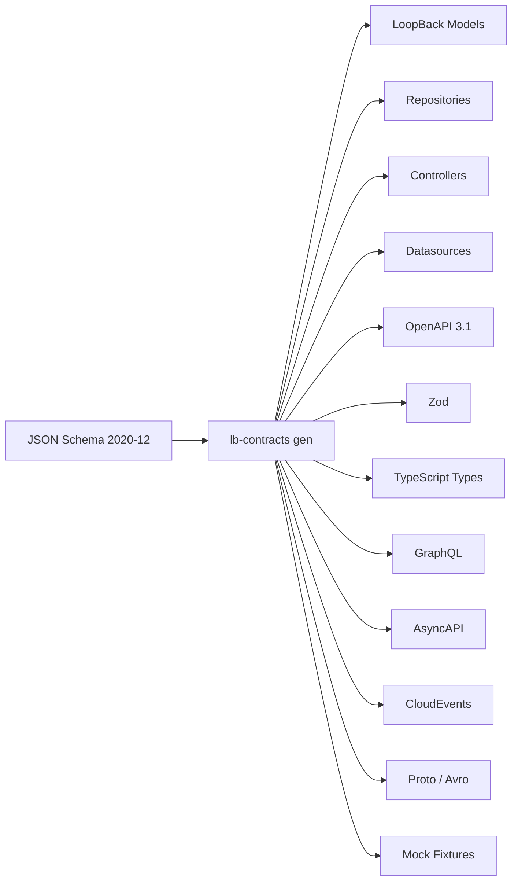

# @ebarahona/loopback-contracts

Contract (JSON Schema-first) code generation for LoopBack 4.

`@ebarahona/loopback-contracts` turns JSON Schema 2020-12 contracts into LoopBack 4 models, repositories, controllers, datasources, OpenAPI 3.1 output, and optional sidecar formats such as Zod, TypeScript types, GraphQL, AsyncAPI, Protocol Buffers, Avro, CloudEvents, OpenAPI components, and mock fixtures.

It is built for teams that want the speed of contract-driven scaffolding without giving up LoopBack 4's runtime dynamic dependency injection, extension points, and composable architecture.

---

## Why this exists

Most backend teams end up describing the same shape multiple times:

- JSON Schema
- OpenAPI schemas
- LoopBack models
- repositories
- controllers
- validators
- SDK types
- event payloads
- mock fixtures
- GraphQL or AsyncAPI sidecars

Over time, those definitions drift.

`@ebarahona/loopback-contracts` makes JSON Schema the source of truth.

Define the contract once. Generate the rest.

---

## What it generates

Core LoopBack outputs:

- LoopBack 4 models
- repositories
- controllers
- datasources
- OpenAPI 3.1 document
- generated barrels
- project meta-schemas

Optional sidecar outputs:

| Flag | Output |
|---|---|
| `--emit-zod` | Zod validators |
| `--emit-types` | TypeScript interfaces |
| `--emit-graphql` | GraphQL code-first decorators |
| `--emit-graphql-sdl` | GraphQL SDL |
| `--emit-cloudevents` | typed CloudEvents wrappers |
| `--emit-asyncapi` | AsyncAPI 3.0 message/catalog fragments |
| `--emit-proto` | Protocol Buffers schema |
| `--emit-avro` | Avro schema |
| `--emit-openapi-components` | OpenAPI components fragment |
| `--emit-mock-data` | mock JSON fixture |

---

## What this is not

`@ebarahona/loopback-contracts` is not:

- a runtime transport framework
- a Kafka framework
- a Redis Streams framework
- a queue system
- a NestJS replacement
- a generic OpenAPI generator replacement

It is a JSON Schema-driven code generation substrate for LoopBack 4.

Some generated sidecars, such as AsyncAPI or CloudEvents, can describe message contracts, but this package does not provide the runtime transport layer that sends, receives, retries, or persists messages.

---

## Who this is for

### Existing LoopBack 4 users

Use this if we like LoopBack 4's architecture but want less manual wiring.

It helps generate the repetitive pieces while keeping the parts that make LoopBack powerful:

- dependency injection
- extension points
- repositories
- datasources
- controllers
- OpenAPI integration
- runtime composition

### Former LoopBack 3 users

LoopBack 3 was fast.

Many teams still miss:

- model-first development
- quick CRUD scaffolding
- convention-driven productivity
- low-friction API creation

This package brings back some of that speed on top of LoopBack 4's TypeScript-first architecture.

### NestJS users

NestJS has strong ergonomics, but many teams still duplicate contracts across:

- DTOs
- decorators
- validators
- Swagger metadata
- generated types
- event schemas

`@ebarahona/loopback-contracts` takes a contract-first approach.

The schema comes first. The framework artifacts are generated from it.

---

## Mental model



The contract is the source of truth.

Everything else is a projection.

---

## Installation

```bash
npm install @ebarahona/loopback-contracts
```

LoopBack 4 packages are peer dependencies:

```bash
npm install @loopback/core @loopback/repository @loopback/rest
```

Node.js requirement:

```txt
Node.js >= 20.19.0
```

---

## Optional sidecar dependencies

Sidecar generators are loaded lazily. Install only what we emit.

| Sidecar | Install |
|---|---|
| Zod validators | `npm install zod json-schema-to-zod` |
| TypeScript types | `npm install json-schema-to-typescript` |
| GraphQL | `npm install quicktype-core` |
| Protocol Buffers | `npm install quicktype-core` |
| Avro | `npm install quicktype-core` |
| CloudEvents | `npm install cloudevents` |
| Mock data | `npm install json-schema-faker` |
| AsyncAPI | no extra package |
| OpenAPI components | no extra package |

If an emit flag is enabled without the required package installed, generation fails fast with the missing package name and install command.

---

## Quick start

Initialize the project:

```bash
lb-contracts init
```

Add a datasource:

```bash
lb-contracts ds primary --adapter memory
```

Create a contract:

```bash
lb-contracts contract order
```

Generate artifacts:

```bash
lb-contracts gen
```

Generate artifacts with sidecars:

```bash
lb-contracts gen --emit-zod --emit-types --emit-openapi-components
```

Run in watch mode:

```bash
lb-contracts gen --watch
```

or:

```bash
lb-contracts dev
```

Validate authored files without writing generated output:

```bash
lb-contracts validate
```

---

## Example workflow

Create a contract:

```bash
lb-contracts contract order
```

This creates:

```txt
schemas/order.schema.json
configs/order.config.json
```

Example schema:

```json
{
  "$schema": "https://json-schema.org/draft/2020-12/schema",
  "$id": "order",
  "title": "Order",
  "type": "object",
  "required": ["id", "status", "total"],
  "properties": {
    "id": {
      "type": "string"
    },
    "status": {
      "type": "string",
      "enum": ["pending", "paid", "cancelled"]
    },
    "total": {
      "type": "number",
      "minimum": 0
    },
    "createdAt": {
      "type": "string",
      "format": "date-time"
    }
  }
}
```

Generate:

```bash
lb-contracts gen
```

Generated files follow the `.base.*` convention:

```txt
src/
  models/
    order.base.model.ts
    index.ts

  repositories/
    order.base.repository.ts
    index.ts

  controllers/
    order.base.controller.ts
    index.ts
```

If sidecars are enabled:

```bash
lb-contracts gen --emit-zod --emit-types --emit-mock-data
```

Additional files are generated:

```txt
src/
  models/
    order.zod.ts
    order.types.ts
    order.mock.json
```

---

## Generated file rules

The generator separates machine-owned files from user-owned files.

| File type | Rule |
|---|---|
| `.base.*` files | regenerated on every `lb-contracts gen` |
| extension files | scaffolded once with `lb-contracts override` |
| `_meta/` files | regenerated, should not be committed |
| `.loopback/cache/` | generated cache, should not be committed |
| `schemas/` | authored by the user |
| `configs/` | authored by the user |
| `datasources.json` | authored by the user |
| `loopback.config.json` | authored by the user |

Do not edit `.base.*` files directly.

Use overrides for custom logic.

---

## Overrides

Generated base files are safe to regenerate because custom code lives in extension files.

Create an override:

```bash
lb-contracts override controller order
```

Example output:

```txt
src/controllers/order.controller.ts
```

The generated base remains machine-owned:

```txt
src/controllers/order.base.controller.ts
```

The override file is user-owned and scaffolded once.

This keeps regeneration safe.

---

## Project layout

A typical generated project looks like this:

```txt
my-app/
  loopback.config.json
  datasources.json

  schemas/
    order.schema.json

  configs/
    order.config.json

  _meta/
    model-config.schema.json
    datasources.schema.json
    emitter.schema.json
    loopback-config.schema.json

  .loopback/
    cache/

  emitters/
    audit-envelope.emitter.json

  src/
    models/
      order.base.model.ts
      order.model.ts
      order.zod.ts
      order.types.ts
      order.graphql.ts
      order.cloudevents.ts
      order.asyncapi.yaml
      order.proto
      order.avsc
      order.openapi-components.yaml
      order.mock.json
      index.ts

    repositories/
      order.base.repository.ts
      order.repository.ts
      index.ts

    controllers/
      order.base.controller.ts
      order.controller.ts
      index.ts

    datasources/
      primary.base.datasource.ts
      primary.datasource.ts
      index.ts
```

---

## CLI reference

### `lb-contracts init`

Scaffolds:

```txt
loopback.config.json
```

Use this to configure:

- schema directories
- remote schema sources
- default sidecar emission settings
- validator settings
- generation behavior

The command refuses to overwrite an existing config.

---

### `lb-contracts contract <name>`

Scaffolds:

```txt
schemas/<name>.schema.json
configs/<name>.config.json
```

Use this to create a new JSON Schema contract and matching generation config.

The command refuses to overwrite existing files.

---

### `lb-contracts ds <name> --adapter <kind>`

Adds a datasource entry to:

```txt
datasources.json
```

Example:

```bash
lb-contracts ds primary --adapter memory
```

The command refuses duplicate datasource entries.

---

### `lb-contracts override <kind> <contract>`

Scaffolds a user-owned extension file.

Examples:

```bash
lb-contracts override model order
lb-contracts override repository order
lb-contracts override controller order
lb-contracts override datasource primary
```

Generated `.base.*` files continue to regenerate.

Override files are user-owned and scaffolded once.

---

### `lb-contracts gen`

Runs the full generation pipeline.

It regenerates:

- `_meta/*.schema.json`
- `.base.*` TypeScript files
- enabled sidecars
- generated barrels
- OpenAPI output

It does not overwrite authored contracts or override files.

---

### `lb-contracts gen --watch`

Runs generation continuously.

Alias:

```bash
lb-contracts dev
```

---

### `lb-contracts validate`

Runs validation without writing generated files.

Useful in CI.

---

### `lb-contracts gen --strict`

Promotes lossy-translation warnings to errors.

Recommended for CI when we do not want silent approximations in sidecar output.

---

### `lb-contracts gen --skip-tsc`

Skips the final `tsc --noEmit` validation stage.

Useful for faster local reruns when TypeScript validation runs elsewhere.

---

## Configuration

Every emit flag has a matching `loopback.config.json` setting.

Example:

```jsonc
{
  "emit": {
    "zod": true,
    "types": true,
    "openapi-components": true,
    "mock-data": true
  }
}
```

With this configuration, a plain generation command uses those defaults:

```bash
lb-contracts gen
```

---

## Schema sources

Schemas can come from multiple source kinds.

| Source | Example |
|---|---|
| local directory | `./schemas/` |
| npm package | `npm:@my-org/contracts@^1.2.0` |
| git+https | `git+https://github.com/my-org/contracts.git#v1.2.0` |
| https | `https://example.com/contracts/order.schema.json` |
| plugin source | `s3://...`, `oci://...`, or another resolver registered by a plugin |

Source specs are configured in `loopback.config.json`.

Remote schemas are cached under:

```txt
.loopback/cache/
```

---

## Validation pipeline

Every `lb-contracts gen` run follows the same deterministic pipeline:

1. source fetch
2. JSON Schema validation
3. schema dedupe
4. `$ref` resolution
5. config validation
6. backward-compatibility diff
7. codegen and emitter dispatch
8. `tsc --noEmit`

If a stage fails, the command stops with an actionable error.

---

## Extension points

The package exposes extension-point tags for plugins.

| Tag | Purpose |
|---|---|
| `EMITTER_TAG` | add a new projection emitter |
| `SOURCE_TAG` | add a schema source resolver |
| `SOURCE_EXTENSION_TAG` | contribute import-source wizard entries |
| `EXTENSION_KEYWORD_TAG` | handle custom `x-*` JSON Schema keywords |
| `META_SCHEMA_CONTRIBUTOR_TAG` | contribute generated meta-schema options |
| `VALIDATOR_TAG` | add Ajv formats or keywords |

Emitters registered under `EMITTER_TAG` become part of the generation pipeline.

The CLI, init prompts, and generated meta-schemas can discover registered emitters without manually editing the CLI.

---

## Emitters

An emitter turns a JSON Schema contract into an output artifact.

Built-in emitter targets include:

- LoopBack model
- LoopBack repository
- LoopBack controller
- datasource
- OpenAPI 3.1
- Zod
- TypeScript types
- GraphQL
- CloudEvents
- AsyncAPI
- Protocol Buffers
- Avro
- OpenAPI components
- mock fixtures

There are two emitter contribution paths.

---

### Code-based emitters

Use a code-based emitter when the projection needs real translation logic.

Good examples:

- Zod
- GraphQL
- Protocol Buffers
- Avro
- custom enterprise SDK generation
- complex org-specific projections

A code-based emitter is published as TypeScript and registered through LoopBack's extension system.

---

### Manifest-backed emitters

Use a manifest-backed emitter when the projection is mostly mechanical.

Good examples:

- internal event envelopes
- audit wrappers
- custom JSON/YAML mirrors
- project-local templates
- simple generated sidecars

A manifest-backed emitter can be shipped as project files:

```txt
emitters/
  audit-envelope.emitter.json
  audit-envelope.ejs
```

This is useful when we want a local projection without publishing a TypeScript package.

---

## Lossy translation

JSON Schema 2020-12 is more expressive than many target formats.

Some projections may lose information.

Examples:

- JSON Schema unions may not map perfectly to GraphQL
- certain validation keywords may not map cleanly to Protocol Buffers
- format-specific metadata may need approximations

The generator aggregates lossy-translation warnings at the end of generation.

Use strict mode in CI:

```bash
lb-contracts gen --strict
```

---

## OpenAPI output

The engine generates OpenAPI 3.1 from JSON Schema contracts.

The goal is to keep the generated REST surface and the contract aligned.

OpenAPI is an output of the schema-first workflow, not the source of truth.

---

## Importing from other formats

`@ebarahona/loopback-contracts` consumes JSON Schema.

Importing from other formats belongs in the sibling import package:

```txt
@ebarahona/loopback-contracts-import
```

That package covers the inverse direction, such as:

- Zod to JSON Schema
- OpenAPI to JSON Schema
- WSDL to JSON Schema
- Avro to JSON Schema
- Protocol Buffers to JSON Schema
- GraphQL SDL to JSON Schema
- AsyncAPI to JSON Schema
- live database to JSON Schema

Once imported, the generated `schemas/*.schema.json` files can be consumed by `@ebarahona/loopback-contracts`.

---

## Why not just use OpenAPI Generator?

OpenAPI Generator is excellent for generic clients and servers.

This project is focused on LoopBack 4-specific generation:

- `@model`
- `@property`
- repositories
- controllers
- datasources
- generated barrels
- LoopBack project layout
- runtime dependency injection compatibility
- extension-friendly regeneration rules

The goal is not to replace every OpenAPI generator.

The goal is to make LoopBack 4 contract-first development faster, safer, and more consistent.

---

## Why JSON Schema first?

JSON Schema is a strong source of truth because it can describe data independently from a specific framework.

From one schema, the engine can project:

- OpenAPI spec
- LoopBack models
- validators
- TypeScript types
- mock data
- event sidecars
- schema fragments for other ecosystems

This keeps framework code downstream from the contract.

---

## LoopBack 4 fit

LoopBack 4 is a strong fit because it already provides:

- dependency injection
- repositories
- datasources
- controllers
- OpenAPI integration
- extension points
- lifecycle hooks
- runtime composition

`@ebarahona/loopback-contracts` does not fight those primitives.

It generates into them.

---

## Coming from LoopBack 3

LoopBack 3 users often miss how quickly they could move from a model to a working API.

This project aims to recover that speed without going back to LB3's older architecture.

Instead of:

```txt
model-config.json as the whole world
```

we use:

```txt
JSON Schema 2020-12
+ model configs
+ datasource configs
+ generated LB4 artifacts
+ user-owned overrides
```

The result is closer to LB3 productivity, but built on LB4's TypeScript and dependency injection model.

---

## Coming from NestJS

NestJS is application-first.

This package is contract-first.

In NestJS, teams often define the same shape across DTOs, decorators, validators, Swagger metadata, and generated clients.

With `@ebarahona/loopback-contracts`, the shape starts as JSON Schema and the framework artifacts are projected from it.

This is useful when the contract needs to outlive one service or one framework layer.

---

## Current package format

The package currently ships as CommonJS.

```json
{
  "type": "commonjs"
}
```

ESM compatibility can still matter for future output targets and downstream projects, but this package is not currently ESM-native.

---

## Security notes

Remote schema sources and project-local emitters should be treated as codegen inputs.

Review the security docs for production and CI usage, especially when using:

- remote HTTPS schemas
- git-based schema sources
- npm-based schema sources
- project-local manifest emitters
- emitter sandbox settings
- SSRF guards
- host allowlists

See:

```txt
docs/security.md
```

---

## Recommended gitignore entries

Generated metadata and cache directories should not be committed:

```gitignore
_meta/
.loopback/cache/
```

Generated `.base.*` files may be committed if the application expects generated source to live in the repo.

Choose the policy that matches the team's workflow.

---

## Documentation

- [CLI reference](./docs/cli.md)
- [Architecture](./docs/architecture.md)
- [Emitters](./docs/emitters.md)
- [Security](./docs/security.md)
- [Contributing](./CONTRIBUTING.md)
- [Help wanted](./HELP_WANTED.md)
- [Style guide](./STYLE_GUIDE.md)
- [Roadmap](./ROADMAP.md)

API reference:

- [TypeDoc](https://ebarahona.github.io/loopback-contracts)

---

## Development

Install dependencies:

```bash
npm install
```

Build:

```bash
npm run build
```

Run tests:

```bash
npm test
```

Run unit tests:

```bash
npm run test:unit
```

Run integration tests:

```bash
npm run test:integration
```

Lint:

```bash
npm run lint
```

Format:

```bash
npm run format
```

Run the local CLI:

```bash
npm run cli
```

Generate TypeDoc:

```bash
npm run docs
```

---

## Package scripts

| Script | Purpose |
|---|---|
| `npm run build` | compile TypeScript and copy templates |
| `npm run clean` | remove `dist` |
| `npm run lint` | run ESLint |
| `npm run format` | run Prettier |
| `npm test` | run Vitest |
| `npm run test:unit` | run unit tests |
| `npm run test:integration` | run integration tests |
| `npm run docs` | generate TypeDoc |
| `npm run cli` | run local CLI entrypoint |
| `npm run bench` | run benchmarks |

---

## Design principles

### Contracts are source of truth

Framework code should derive from contracts, not drift away from them.

### Generated code must be safe to regenerate

Machine-owned files use `.base.*`.

User-owned files are scaffolded once.

### Sidecars are opt-in

Projects should only pay for the outputs they use.

### Extension points should be real extension points

New emitters, validators, schema sources, and meta-schema contributors should be pluggable.

### LoopBack conventions matter

Generated output should feel native to LoopBack 4.

---

## Roadmap

See:

```txt
ROADMAP.md
```

Areas of ongoing work include:

- additional emitters
- stronger manifest-backed emitter workflows
- improved developer ergonomics
- richer examples
- import workflows through the sibling import package
- stricter CI validation patterns
- ESM compatibility exploration

---

## Contributing

Contributions are welcome.

Good areas to help:

- examples
- emitter improvements
- docs
- tests
- schema source resolvers
- validator extensions
- import workflows
- developer experience

Read:

- [CONTRIBUTING.md](./CONTRIBUTING.md)
- [HELP_WANTED.md](./HELP_WANTED.md)
- [STYLE_GUIDE.md](./STYLE_GUIDE.md)
- [CODE_OF_CONDUCT.md](./CODE_OF_CONDUCT.md)

---

## License

MIT
