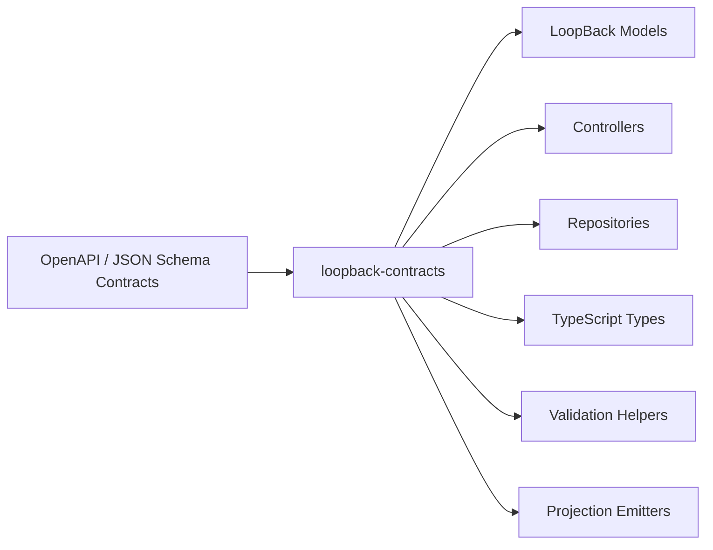
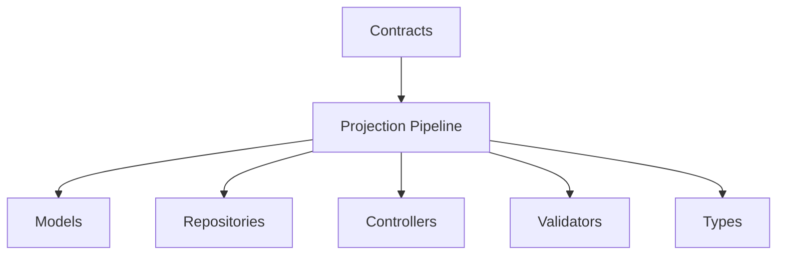

# loopback-contracts

Contract-first code generation and projection architecture for LoopBack 4.

`loopback-contracts` helps teams define contracts once using OpenAPI and JSON Schema, then generate consistent LoopBack artifacts from those contracts.

The project is designed around:
- contract-first workflows
- projection-driven generation
- extensible emitters
- reusable backend architecture
- LoopBack 4 conventions
- TypeScript-first development

Built for:
- Existing LoopBack 4 teams
- Former LoopBack 3 developers
- NestJS users looking for stronger contract-first workflows
- Platform engineering teams
- Large TypeScript backend systems

---

# Why?

Most backend systems duplicate the same contracts across multiple layers:

- Controllers
- DTOs
- Validators
- Models
- Repositories
- OpenAPI specs
- Generated types
- SDKs

Over time this creates:
- schema drift
- inconsistent validation
- duplicated boilerplate
- outdated generated types
- harder API evolution
- increased maintenance cost

`loopback-contracts` turns contracts into the source of truth.

Define contracts once.
Generate consistent backend artifacts everywhere.

---

# The Vision



The goal is not just code generation.

The goal is reusable backend architecture powered by contracts.

---

# What This Project Is

`loopback-contracts` is:
- a contract-first generation framework
- a projection pipeline
- an extensible emitter architecture
- a LoopBack-oriented code generation system

`loopback-contracts` is NOT:
- a transport framework
- a Kafka framework
- a Redis stream framework
- an async queue system
- a NestJS replacement

The current focus is:
- models
- repositories
- controllers
- TypeScript types
- validators
- extensible generation pipelines

---

# Why This Exists

## LoopBack 4 introduced powerful architecture

LoopBack 4 brought:
- Dependency Injection
- OpenAPI-first APIs
- Extension points
- Booters
- Runtime discovery
- Strong TypeScript support

But many teams still experience friction from:
- repetitive scaffolding
- duplicated contracts
- manual synchronization
- inconsistent generation workflows

`loopback-contracts` builds on top of LoopBack 4 to reduce boilerplate while preserving extensibility.

---

# For Former LoopBack 3 Developers

LoopBack 3 made CRUD development extremely fast.

Many developers still miss:
- rapid scaffolding
- model-first workflows
- fast API generation
- convention-driven productivity

`loopback-contracts` aims to bring back rapid development workflows while preserving the architectural strengths of LoopBack 4:
- TypeScript-first
- Dependency Injection
- OpenAPI-first APIs
- Extension points
- Composable architecture

---

# For NestJS Developers

NestJS provides excellent developer ergonomics.

But large systems often still duplicate contracts across:
- DTOs
- validators
- Swagger decorators
- interfaces
- repositories
- generated SDK types

`loopback-contracts` takes a different approach.

Contracts become the foundation of the system itself.

Instead of manually wiring schemas repeatedly, contracts generate reusable backend artifacts automatically.

---

# Quick Start

## Install

```bash
npm install loopback-contracts
```

---

## Initialize contracts

```bash
lb4 contracts:init
```

---

## Generate artifacts

```bash
lb4 contracts:generate
```

---

## Example generated structure

```txt
src/generated/
  controllers/
  models/
  repositories/
  validators/
  types/
```

---

# Example

## Define a contract

```yaml
components:
  schemas:
    User:
      type: object
      required:
        - id
        - email

      properties:
        id:
          type: string

        email:
          type: string
          format: email

        firstName:
          type: string

        createdAt:
          type: string
          format: date-time
```

---

## Generate artifacts

```bash
lb4 contracts:generate
```

---

## Generated outputs

```txt
✓ User model
✓ User repository
✓ Controller scaffolds
✓ Validation helpers
✓ TypeScript types
```

---

# What Gets Generated?

| Contract Input | Generated Output |
|---|---|
| OpenAPI schemas | LoopBack models |
| OpenAPI paths | Controller scaffolds |
| JSON Schema definitions | TypeScript types |
| Model definitions | Repository scaffolds |
| Generator manifests | Projected artifacts |

---

# Core Concepts

# Contract

The source-of-truth schema.

Usually:
- OpenAPI
- JSON Schema
- Model definitions

Contracts describe the system.

---

# Projection

A generated output derived from contracts.

Examples:
- models
- repositories
- controllers
- validators
- TypeScript types

---

# Emitter

A generator responsible for producing a projection.

Examples:
- model emitter
- repository emitter
- controller emitter
- type emitter

---

# Projection Pipeline

A workflow where contracts pass through emitters to generate backend artifacts.



---

# Manifest-backed Emitters

Manifest-backed emitters allow projections to be configured declaratively instead of requiring custom TypeScript subclasses.

This enables:
- reusable generation patterns
- plugin ecosystems
- configurable emitters
- runtime discovery
- lower-friction extension

Example concept:

```json
{
  "emitter": "model",
  "source": "contracts/user.yaml",
  "output": "src/generated/models"
}
```

---

# Architecture Philosophy

`loopback-contracts` follows several core principles.

---

## Contracts are the source of truth

Contracts should drive:
- models
- repositories
- validation
- generated types
- API scaffolding

Not the other way around.

---

## Projection-driven architecture

Every output is a projection derived from contracts.

This creates:
- consistency
- reuse
- automation
- portability

---

## Plugin-first extensibility

New outputs should be addable without modifying framework internals.

The architecture is designed so emitters can evolve independently.

---

# Why Not Just Use OpenAPI Generator?

OpenAPI Generator is excellent for producing generic clients and servers.

`loopback-contracts` is focused specifically on LoopBack 4 conventions:
- `@model`
- `@property`
- repositories
- controllers
- project structure
- dependency injection-friendly output
- extension-friendly generation

The goal is not to replace every OpenAPI generator.

The goal is to make contract-first LoopBack development faster and more consistent.

---

# Comparison

| Tool | Focus |
|---|---|
| NestJS | Decorator-first application framework |
| OpenAPI Generator | Generic client/server generation |
| tsoa | TypeScript → OpenAPI |
| LoopBack 4 | OpenAPI-first backend framework |
| loopback-contracts | Contract-first LoopBack generation |

---

# Migration Guides

# Coming from LoopBack 3?

LoopBack 3 provided:
- rapid CRUD APIs
- model-first workflows
- automatic scaffolding

`loopback-contracts` aims to modernize those workflows for:
- TypeScript
- LoopBack 4
- extensible architectures
- projection-driven generation

---

# Coming from NestJS?

NestJS is application-first.

`loopback-contracts` is contract-first.

Instead of manually wiring:
- DTOs
- validators
- Swagger decorators
- generated types

contracts become the source of truth that drive generation automatically.

This approach works especially well for:
- platform teams
- large backend systems
- reusable APIs
- multi-service environments

---

# Project Structure

Example project layout:

```txt
contracts/
  schemas/
  paths/

src/
  generated/
    controllers/
    models/
    repositories/
    validators/
    types/

emitters/
configs/
```

---

# Planned Examples

Planned example applications:
- Todo API
- E-commerce API
- Monorepo example
- Manifest-backed emitter example
- Custom emitter example

---

# Roadmap

Areas currently being explored:
- first-class projection emitters
- manifest-backed emitters
- runtime plugin discovery
- cleaner generation pipelines
- ESM compatibility
- improved CLI workflows
- better extensibility
- reusable emitter packages

---

# ESM Support

The project is exploring stronger ESM compatibility while preserving CommonJS interoperability where possible.

Future goals include:
- ESM-native generation
- configurable import extensions
- dual ESM/CJS support
- improved Node 22+ compatibility

---

# Monorepo Support

`loopback-contracts` is designed to work well inside monorepos.

Potential workflows include:
- shared contracts packages
- shared generated types
- reusable emitters
- multi-service generation pipelines

---

# Plugin Development

Custom emitters can be used to generate additional projections.

Potential future emitter targets:
- SDK generation
- GraphQL projections
- AsyncAPI contracts
- infrastructure manifests

These are future architectural directions, not current built-in features.

---

# Design Goals

- Contract-first
- TypeScript-native
- Plugin-driven
- Extensible
- Runtime composable
- Large-system friendly
- LoopBack-oriented
- Projection-driven

---

# Documentation

## Guides

- [Architecture](./docs/architecture.md)
- [Emitters](./docs/emitters.md)
- [Contracts](./docs/contracts.md)
- [Plugin Development](./docs/plugins.md)

---

# Contributing

Contributions are welcome.

Areas of interest:
- emitters
- OpenAPI tooling
- manifest-backed generation
- ESM support
- developer ergonomics
- projection pipelines

---

# Long-Term Vision

`loopback-contracts` aims to become a reusable projection architecture for backend systems built on LoopBack.

The future is not:
- manually wiring models
- duplicating DTOs
- rebuilding validators
- maintaining disconnected generated types

The future is:
- contracts as infrastructure
- projections as architecture
- reusable backend systems

---

# License

MIT
